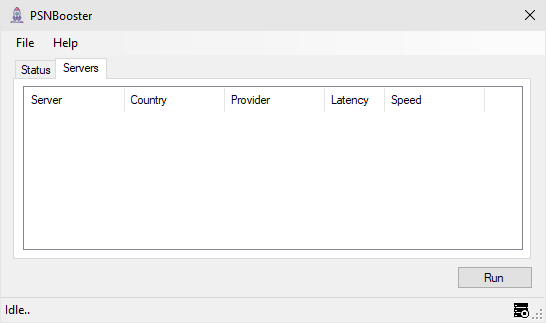

.. _getting-started:

Getting Started
===============

**PSNBooster** is a powerful proxy & DNS server application for Playstation Network that
can boost your ``Playstation 4`` devices download speeds by a margin.

Main features of PSNBooster are;

- Dynamically discovering more than 300+ ``Playstation Network`` download servers.
- Speed testing discovered servers & selecting the fastest ones.
- Embedded HTTP proxy server that locks your downloads to fastest servers.
- Embedded DNS server that can redirect your ``Playstation 4`` to fastest servers.

Quick start video
-----------------

This screencast will help you get started or you can read our guide below.

``TODO: VIDEO HERE``

Quickstart
-----------

- Download the application from `https://psnbooster.com. <https://psnbooster.com/>`_ and install it.
- Run the setup and install the application on your computer.
- Run the application.

Discovering servers
------------------------------------------------

In order to find the fastest download server available to you, ``Playstation Network`` download servers
should be discovered first which is a trivial task.

Once the main window is open, you can press ``Run`` button to start discovering download servers. Based on
your settings, ``PSNBooster`` will find a minimum amount of configured servers.

Finding the fastest servers
---------------------------

After discover process is complete, ``PSNBooster`` will move on to speed testing them by;

- Pinging and checking the latency.
- Speed testing by download a sample file.
